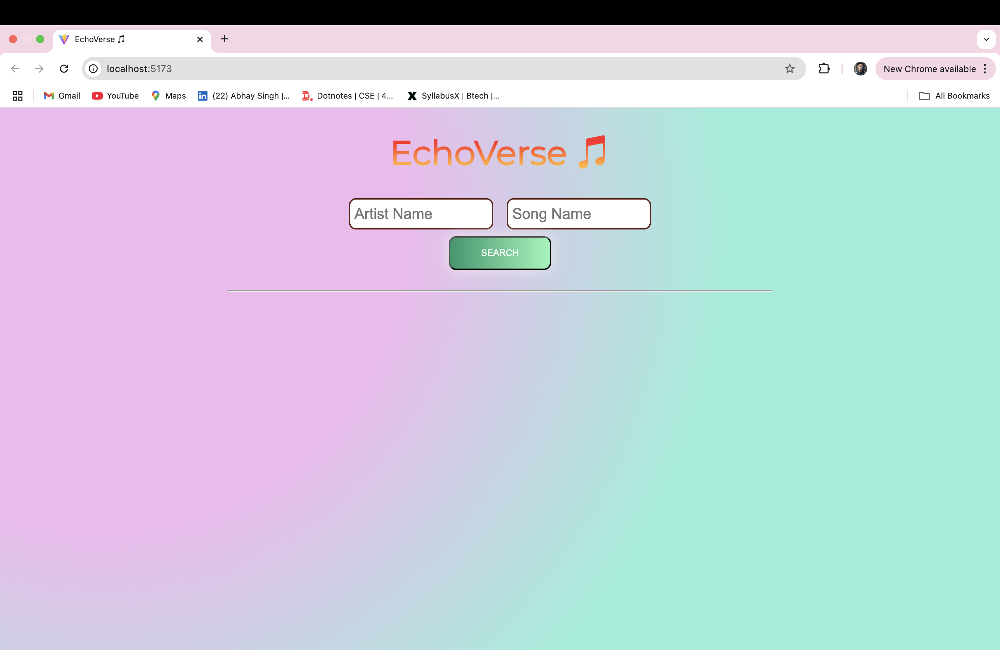
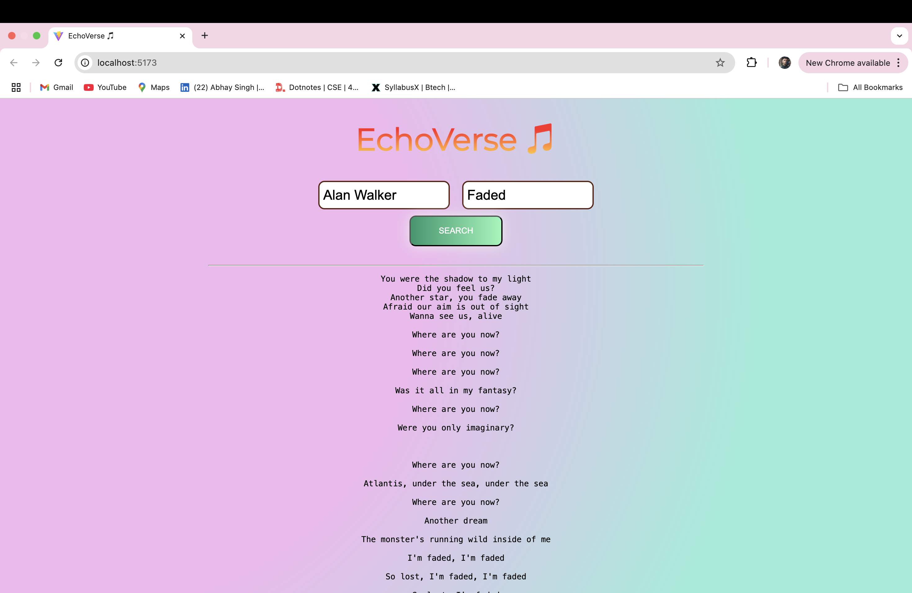

# 🎵 EchoVerse 🎵

EchoVerse is a simple responsive and clean lyrics finder web app built using **React**. It allows users to search for song lyrics by entering the artist name and song title. It fetches lyrics from the [api.lyrics.ovh](https://lyrics.ovh/) API using **Axios** and displays them in an easy-to-read format.

---

## 🚀 Features

- 🎤 Search lyrics by Artist and Song name
- 📄 Displays lyrics fetched from an open API
- 💡 Simple, clean, and colorful UI with gradient background
- ⚡ Built using React and Axios

---

## 🛠️ Tech Stack

- **React**
- **Axios**
- **ReactDOM**
- **api.lyrics.ovh** (Lyrics API)

---

## 🔍 Usage

1. Enter the artist's name in the first input field.
2. Enter the song name in the second input field.
3. Click the Search button.
4. Lyrics will be fetched from https://api.lyrics.ovh/v1/{artist}/{title} and displayed below the search bar.

---

## 🔗 API Reference

> Base URL: https://api.lyrics.ovh/v1/
> Example: https://api.lyrics.ovh/v1/Coldplay/Yellow

---

## 🧪 Example

-> Artist: Alan Walker
-> Song: Faded
Returns lyrics for the song Yellow by Coldplay.

---

## 📸 Screenshot

---

## 🙌 Acknowledgements

Thanks to Lyrics.ovh for the free lyrics API.

---

## 📃 License
This project is licensed under the MIT License.

